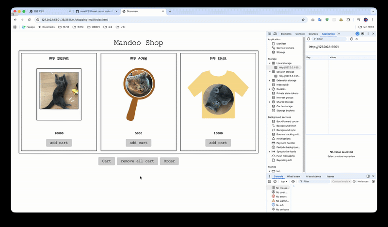

## 251124 수업문제풀이

### MISSION 웹스토리지 사용해서 만두 굿즈 쇼핑몰 만들기

- 만두 굿즈 장바구니 담으면 브라우저를 껐다 켜도 장바구니 담긴 기록은 남아있습니다.
- 새 탭을 열 때마다 모달이 뜹니다.
- 하지만 새탭이 아니고 새로고침할 때는 “오늘 그만보기”를 눌렀기 떄문에 모달이 안 뜹니다.
- Cart버튼을 누르면 장바구니 페이지로 이동하고, back 버튼을 누르면 이전으로 이동합니다.

[↗️ 링크 바로가기](https://lyla-bae.github.io/goorm_FE/JS/251124/shopping-mall/index.html)
