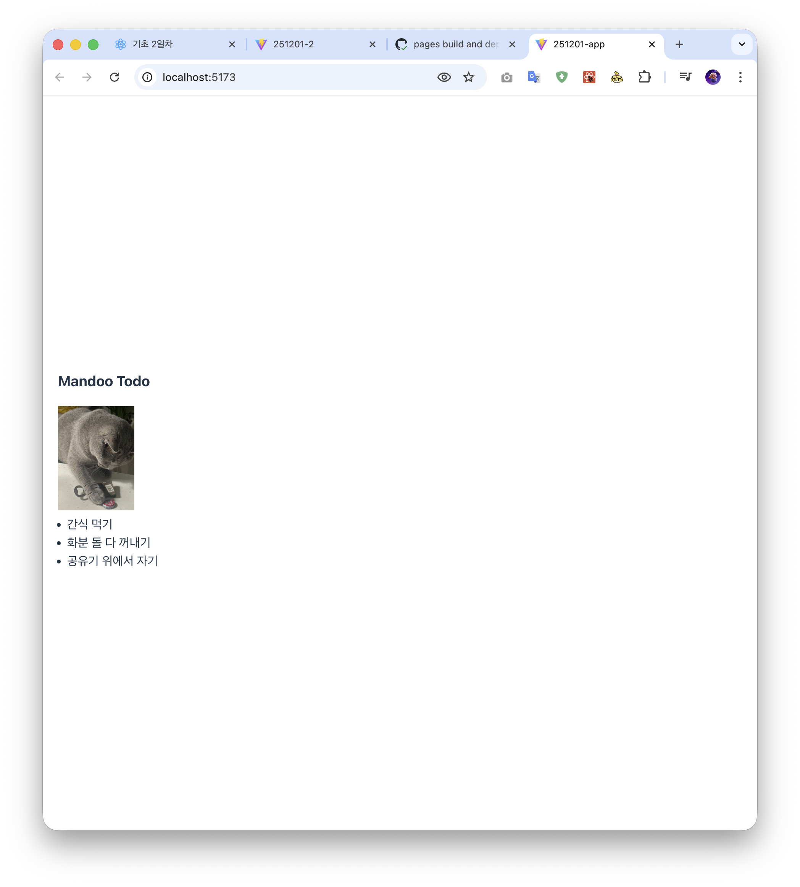
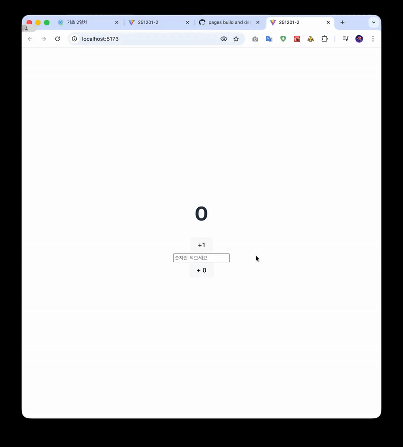

# 251201 실습문제 풀이

리액트를 따로 설치해서 풀어보았습니다 :)

## 문제 1: 정적 컴포넌트 렌더링

`251201-1` 폴더는 이미지와 텍스트 리스트를 포함하는 간단한 정적 컴포넌트를 렌더링하는 예제입니다.

- `Mandoo.jsx` 컴포넌트는 이미지를 표시합니다.
- `App.jsx`는 `Mandoo` 컴포넌트와 할 일 목록을 화면에 표시합니다.

### 실행 결과

---

## 문제 2: 동적 상태 관리 컴포넌트

`251201-2` 폴더는 사용자의 입력에 따라 동적으로 상태를 변경하는 카운터 컴포넌트 예제입니다.

- `useState` Hook을 사용하여 숫자 상태를 관리합니다.
- 기본적으로 1씩 증가하는 버튼이 있습니다.
- 사용자가 입력 필드에 숫자를 넣고 버튼을 클릭하면, 해당 숫자만큼 카운터를 증가시킬 수 있습니다.

### 실행 결과

